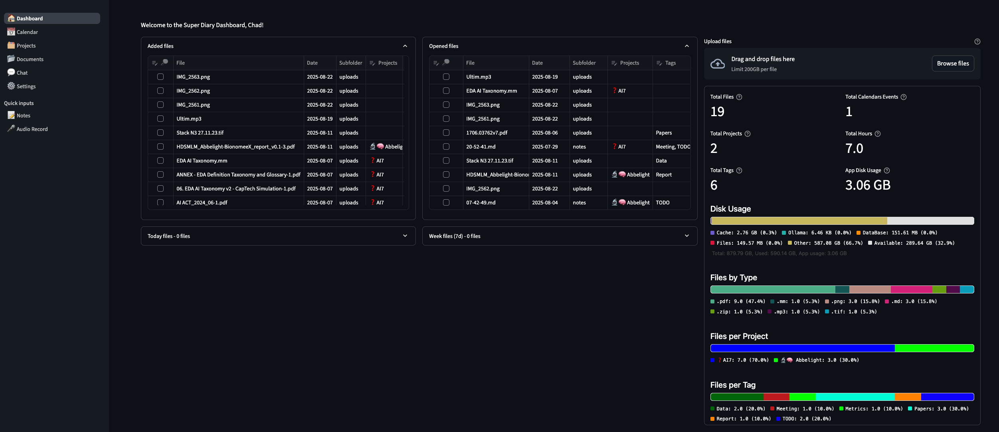
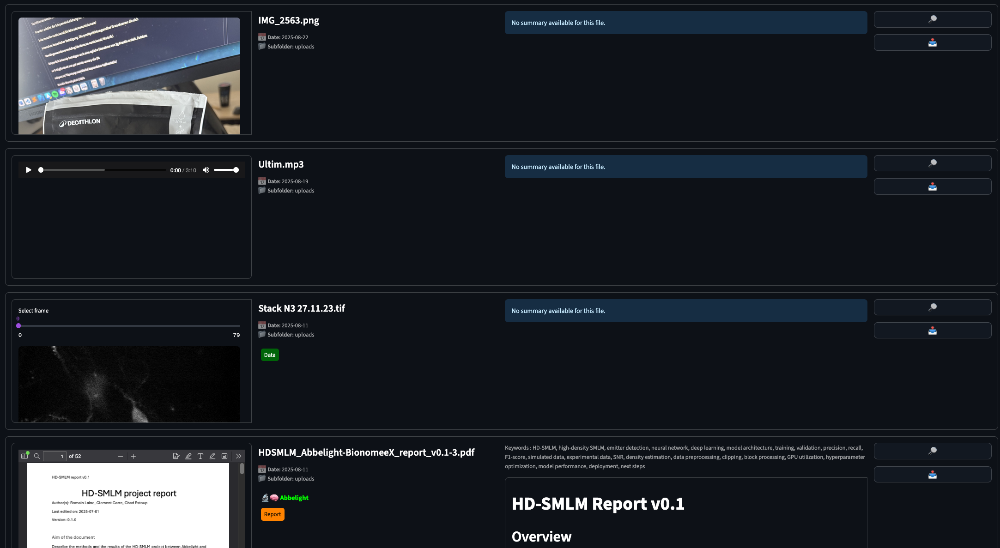
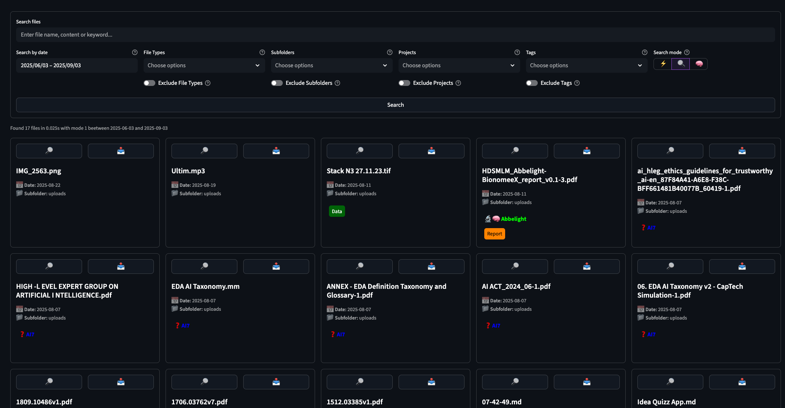
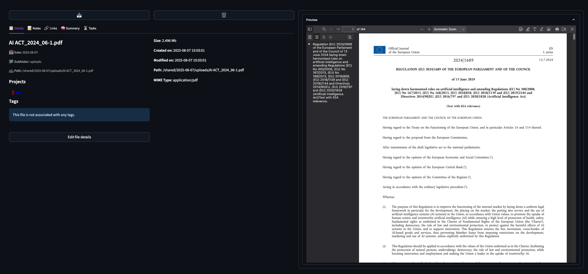
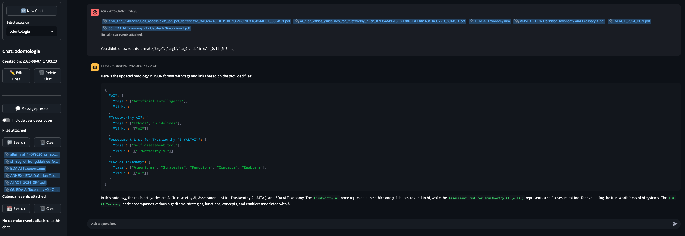
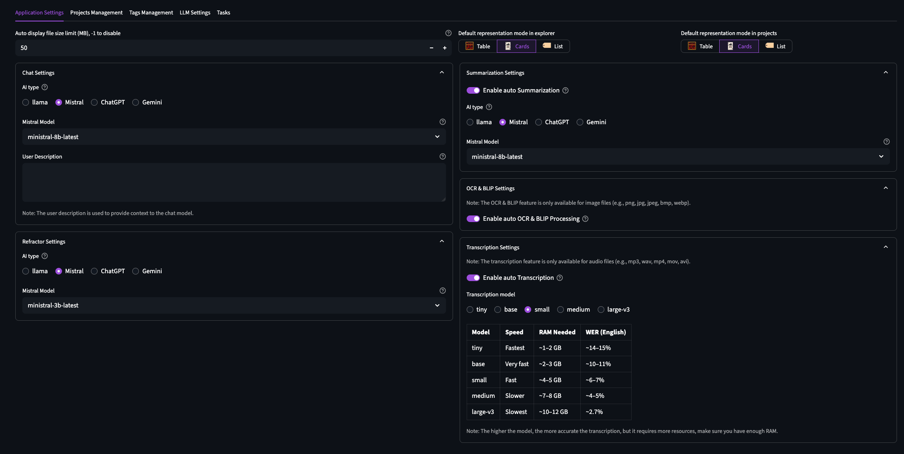
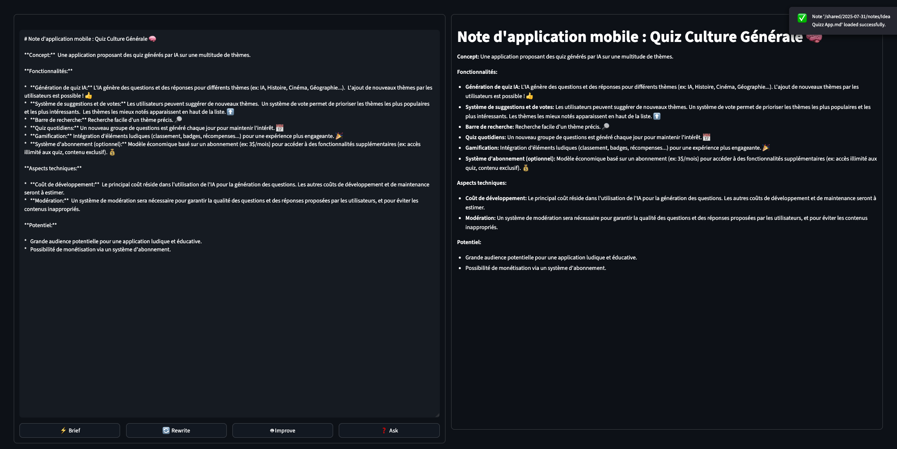

  

# Super Diary

**Super Diary** is a powerful, AI-enhanced web application for organizing, searching, and extracting content from your documents.  
Inspired by tools like *Paperless*, it leverages state-of-the-art models to unlock the full potential of your file collection.

## 🚀 Features

- 🔍 **Smart Search**: Find files using a powerful search engine that understands context. It searches *within* your documents using the app’s full suite of AI tools.
- 🧠 **AI Extraction**:
  - **LLMs** (llama3) for text understanding, summarization, tagging, and Q&A.
  - **Whisper** for audio transcription.
  - **PaddleOCR** for OCR on images.
  - **BLIP** for image understanding and captioning on images.
- 📂 **Universal File Support**: Text, PDF, images, audio, markdown, and more.
- 🔒 **Local-First**: Your data stays yours. All processing (including AI) is done locally—unless you opt to use ChatGPT or Gemini.
- 💻 **Lightweight & Powerful**: Runs on any machine with at least 8 GB RAM—even without a GPU!

## 📦 Tech Stack

- **Back**: Python / FastAPI / SQLAlchemy  
- **Front**: Streamlit  
- **AI**: Llama3, Whisper, PaddleOCR, BLIP  
- **Infra**: Docker for deployment  

## 📷 Preview  
## 📷 Preview

  

*Home dashboard with an overview of your files, and stats.*

  

*Search results displayed in a line view for easy navigation and quick access.*

  

*Search results displayed in a card view for a visual and organized experience.*

  

*File viewer with support for various file types, including text, PDF, images, and more.*

  

*AI-powered chat assistant that reads extracted features and linked information from your files and calendar events.*

  

*Settings panel to configure AI models, external connections (Ollama, Mistral, ChatGPT, Gemini), and app preferences.*

  

*Notes editor with block support for structured and organized note-taking.*


## 🚀 Launch

> Install [Docker](https://docs.docker.com/engine/install/) and [docker compose](https://docs.docker.com/compose/install/).  
#### ⚠️ Make sure you allocated enough RAM to docker (see in settings) ! AI models may crash if not enough RAM.  

Get the app on your server or computer
```bash
git clone https://github.com/yourusername/super-diary.git
cd super-diary
```

Copy and edit .env
```bash
cp .env_ex .env
vim .env
```

Start the web app
```bash
./up.sh
```

Stop the web app
```bash
./down.sh
```  

## 🎓 License

MIT License © Chad Estoup-Streiff


## TODO / Ideas
Ideas:
- Favorites files ? Will display on top when search
- Pin file to dashboard ?
- A robot that looks for files and update summaries if needed (like if the summary is older that file date, in reupload for exemple)
- Github link to add context to chat ?
- Super notes with block ( #%% delimiters )
- audio transcription with online models (mistral or chatgpt ?)
- Page for contacts, add contacts to projects, add tags to contact
- Page de biblio (on intégré au viewer), contenant certains fichiers et les liens entre eux pour faire une visualisation graph
- Change app name (it's more of a super assistant)
- CLIP search on images ?

Bugs:  
None :)

TODO: 
- Page (for volume on front, back can handles a lot of files)

Optimization:
- on search, don't create a new connection for each file